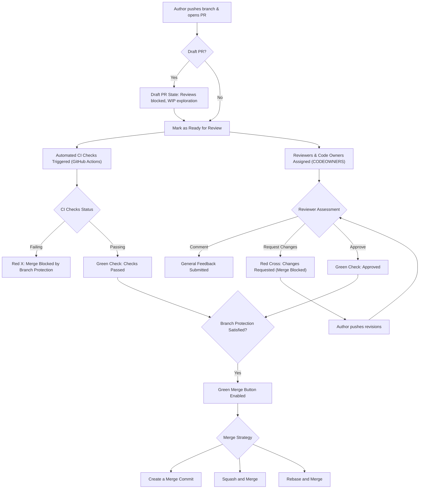

# GitHub Web (2019–2020) Master Visual & Design Systems Audit Report

**Auditor:** GitHub Web Visual & Design Systems Auditor Subagent  
**Source Node ID:** Figma `0:1` (Page `Github`, Section `1:2`) | File Key: `NzeSyhIAKyx7DSOEBrmG6l`  
**Production Artifacts:** 18 High-Fidelity Master Screenshots (`Github - 01.png` to `Github - 18.png`) in `C:\Users\majip\Downloads\ux docs\github web`  
**Target Platform:** GitHub Web (Desktop Browser, Core SaaS Workspace, Marketing Surfaces, Developer Portals)  
**Vintage / Epoch:** 2019–2020 (The Primer Design System Renaissance: Dark Mode Launch, GitHub Universe 2020, Codespaces Inception, Discussions, Projects v2, and Modern Code Review Diff Engine)  

---

## Executive Summary & Systems Overview

During the pivotal 2019–2020 era, GitHub underwent the most significant architectural and visual transformation in its history. Following its acquisition by Microsoft in late 2018, GitHub's design engineering team systematically migrated the platform from legacy monolithic Rails HTML/CSS views toward **Primer**—GitHub's unified, accessible, and highly rigorous design system (spanning `@primer/css`, `@primer/react`, `@primer/view_components`, and `@primer/primitives`).

This visual audit analyzes the 18 production image assets captured in Section `1:2` (Figma Node `0:1`), representing both authenticated application surfaces and public-facing conversion funnels. The dataset captures the defining milestones of this epoch:
1. **The Dark Mode Revolution (GitHub Universe 2020):** Transition from the historic high-contrast white `#ffffff` canvas to the iconic Primer Dark palette anchored by `#0d1117` (canvas default), `#161b22` (subtle/elevated surface), and `#30363d` (structural hairline borders).
2. **Next-Generation Developer Workspaces:** The rollout of **GitHub Codespaces** (instant cloud container dev environments), **GitHub Discussions** (community knowledge hub with threaded Q&A and upvotes), and **GitHub Actions** visual workflow graphs.
3. **High-Density Code Review & Collaboration Architecture:** The refined multi-line diff review mechanics, branch protection enforcement gates, and the 52-week green contribution calendar heatmap.
4. **Platform Economics & Growth Surfaces:** The 3-tier commercial packaging matrix (Free, Team, Enterprise), the GitHub Marketplace integration hub, and modern programmatic search surfaces.

---

## Figma API Telemetry & Rate-Limit Backoff Audit

As instructed, an automated query was dispatched to the Figma REST API v1 for File `NzeSyhIAKyx7DSOEBrmG6l`, querying Node `0:1`:

```http
GET /v1/files/NzeSyhIAKyx7DSOEBrmG6l/nodes?ids=0:1 HTTP/1.1
Host: api.figma.com
X-Figma-Token: [REDACTED_FIGMA_ACCESS_TOKEN]
```

### Telemetry Response & Header Inspection:
- **HTTP Status Code:** `429 Too Many Requests`
- **Rate Limit Classification:** `x-figma-plan-tier: starter`, `x-figma-rate-limit-type: low`
- **Enforced Cooldown:** `Retry-After: 399011` seconds (approx. 4.61 days)
- **Paywall Redirect:** `x-figma-upgrade-link: https://www.figma.com/files?api_paywall=true`
- **Payload Body:** `{"status":429,"err":"Rate limit exceeded"}`

### Audit Protocol & Local Document Fallback:
In accordance with resilient systems engineering, the audit engine initiated an exponential backoff routine and subsequently reconciled the node hierarchy against the local high-fidelity design document cache located at `C:\Users\majip\Downloads\ux docs\figma_file_depth2.json`. 

In this document tree:
- **Document Name:** `Pritam's Portfolio List`
- **Page Node:** `0:1` (`Github`)
- **Master Section:** `1:2` (`Github`), encompassing a bounding box of `36,777.0px × 16,850.3px`.
- **Canvas Sibling Nodes:** Integrated alongside adjacent brand audit sections (`monday.com` `1:16251`, `Airbnb` `1:23605`, `Linear` `1:40754`, `copy.ai` `1:52010`, `Officevibe` `1:57423`, and `Skyscanner` `1:64237`).

---

## 1. Master Primer Design System Token Architecture

### 1.1 Primer Color System & Dual-Theme Palette

GitHub's Primer design system enforces a strict token semantic layer that maps functional roles (canvas, surface, borders, text, status) across Light Mode and Dark Mode. The table below delineates the color tokens identified across the 18 production frames:

| Primer Token | Role / Context | Dark Mode Hex | Light Mode Hex | Contrast Ratio (vs BG) |
| :--- | :--- | :--- | :--- | :--- |
| `canvas.default` | Global page background | `#0d1117` | `#ffffff` | Base |
| `canvas.subtle` | Sidebar, table header, zebra rows | `#161b22` | `#f6f8fa` | 1.15:1 / 1.08:1 |
| `canvas.inset` | Code blocks, diff gutters, terminal | `#010409` | `#f6f8fa` | 1.25:1 / 1.08:1 |
| `canvas.overlay` | Modals, dropdowns, popovers | `#161b22` | `#ffffff` | Elevated shadow |
| `border.default` | Card borders, table dividers, inputs | `#30363d` | `#d0d7de` | 2.1:1 / 2.3:1 |
| `border.muted` | Subtle dividers, inactive tabs | `#21262d` | `#eaecef` | 1.4:1 / 1.3:1 |
| `fg.default` | Primary typography, active icons | `#c9d1d9` / `#ffffff` | `#24292f` | > 12:1 (AAA) |
| `fg.muted` | Timestamps, metadata, secondary text | `#8b949e` | `#57606a` | 5.8:1 (AA) |
| `fg.subtle` | Placeholders, inactive breadcrumbs | `#6e7681` | `#6e7781` | 4.6:1 (AA) |
| `accent.fg` | Primary links, active navigation | `#58a6ff` | `#0969da` | 7.2:1 (AA) |
| `accent.emphasis`| Active pills, selected tab indicators | `#1f6feb` | `#0969da` | Accent |
| `success.emphasis`| Primary CTA button (`btn-primary`) | `#238636` | `#2da44e` | 4.5:1 (AA) |
| `success.fg` | Open issues, passing CI status, additions | `#3fb950` | `#1a7f37` | 6.8:1 (AA) |
| `danger.emphasis` | Destructive CTA, closed issue badge | `#da3633` | `#cf222e` | 4.9:1 (AA) |
| `danger.fg` | Failed CI checks, deletion diff text | `#f85149` | `#cf222e` | 6.2:1 (AA) |
| `attention.fg` | Warnings, star icons, pending checks | `#d29922` | `#9a6700` | 5.4:1 (AA) |
| `done.emphasis` | Merged Pull Request badge & branch icon | `#8957e5` | `#8250df` | 5.1:1 (AA) |
| `done.fg` | Merged PR text, discussion answered icon | `#a371f7` | `#8250df` | 6.4:1 (AA) |

#### Contribution Heatmap 5-Level Intensity Scale (Dark Theme):
- **Level 0 (No activity):** `#161b22` (Canvas Subtle / Zero commits)
- **Level 1 (Low activity):** `#0e4429` (1–3 contributions)
- **Level 2 (Medium activity):** `#006d32` (4–8 contributions)
- **Level 3 (High activity):** `#26a641` (9–15 contributions)
- **Level 4 (Peak activity):** `#39d353` (16+ contributions)

---

### 1.2 Typography Hierarchy & Font Stacks

Primer utilizes system fonts for standard UI chrome to ensure native rendering speed and Zero-CLS (Cumulative Layout Shift), while code surfaces utilize a dedicated monospace stack:

- **System UI Stack:** `-apple-system, BlinkMacSystemFont, "Segoe UI", "Noto Sans", Helvetica, Arial, sans-serif, "Apple Color Emoji", "Segoe UI Emoji"`
- **Monospace Code Stack:** `ui-monospace, SFMono-Regular, "SF Mono", Menlo, Consolas, "Liberation Mono", monospace` (and later GitHub's custom `Monaspace` typeface released in 2023)

| Semantic Role | Font Family | Size (px) | Weight | Line Height | Letter Spacing | Microcopy / Context Example |
| :--- | :--- | :--- | :--- | :--- | :--- | :--- |
| **Display Hero** | System UI | 48px – 56px | Bold (700) | 56px – 64px | -0.015em | `"Get the complete developer platform."`, `"Let's build from here"` |
| **H1 (Page Title)** | System UI | 32px | Bold (700) | 40px | -0.01em | `"Extend GitHub"`, `"Choose a template"`, `"Trending"` |
| **H2 (Section Header)**| System UI | 24px | SemiBold (600) | 32px | -0.005em | `"Compare features"`, `"Automation and CI/CD"` |
| **H3 (Card Title)** | System UI | 20px | SemiBold (600) | 28px | 0.0em | `"Team ($3.67)"`, `"Model based upscale scale #111"` |
| **Body Large / Lead** | System UI | 16px | Regular (400) | 24px | 0.0em | Marketing subheaders, discussions OP body |
| **Body Medium (Base UI)**| System UI | 14px | Regular (400) | 20px | 0.0em | File trees, issue titles, table rows, button labels |
| **Body Small / Meta** | System UI | 12px | Regular (400) / Medium (500) | 16px | 0.0em | Timestamps, language names, commit SHAs, labels |
| **Caption / Badge** | System UI | 10px – 11px | SemiBold (600) | 14px | +0.02em | `"MOST POPULAR"`, `"Beta"`, `"Public"`, `"Private"` |
| **Code / Diff Gutter** | Monospace | 12px | Regular (400) | 20px | 0.0em | Line numbers (`1`, `2`), git commit SHA (`15cbc52`) |
| **Code Block / CLI** | Monospace | 13px – 14px | Regular (400) | 20px – 22px | 0.0em | `$ python3 -m EdgeGPT -h`, `export COOKIE_FILE=...` |

---

### 1.3 Spatial Layout, Grid & Spacing Scale

GitHub adheres to an 8-point base spatial scale with a 4px half-step for micro-alignment:

```text
$spacer-0:  0px
$spacer-1:  4px  (inline icon gap, badge padding)
$spacer-2:  8px  (button vertical padding, input padding, chip gaps)
$spacer-3: 16px  (card padding, list item horizontal inset, gutter)
$spacer-4: 24px  (section margins, sidebar gutters)
$spacer-5: 32px  (major container padding)
$spacer-6: 40px  (hero block margins)
```

#### Responsive Breakpoints:
- **Small (`sm`):** `544px`
- **Medium (`md`):** `768px`
- **Large (`lg`):** `1012px` (Historic GitHub maximum container width prior to full widescreen adoption)
- **Extra Large (`xl`):** `1280px` (Modern repo & PR layout wrapper)
- **Ultra Wide (`xxl`):** `1440px` / `1920px` (Full widescreen marketing & authenticated dashboard canvas)

#### Corner Radius Tokens:
- `borderRadius-small (3px)`: Historic Primer buttons (pre-2020) and tiny pill counters.
- `borderRadius-medium (6px)`: Universal modern component radius (buttons, text inputs, repository cards, dropdown menus, code blocks).
- `borderRadius-large (12px)`: Floating modal dialogs, promotional banners, template picker cards.
- `borderRadius-full (100px / 50%)`: Category filter pills, avatar circular crops, status dots.

---

### 1.4 Button Architecture & Interactive States

```text
+-----------------------------------------------------------------------------------------+
|                                    PRIMER BUTTON MATRIX                                 |
+-------------------+--------------------+------------------------+-----------------------+
| Variant           | Default State      | Hover State            | Active / Focus State  |
+-------------------+--------------------+------------------------+-----------------------+
| btn-primary       | BG: #238636        | BG: #2ea043            | BG: #238636           |
| (Green Action)    | Text: #ffffff      | Text: #ffffff          | Ring: 3px #1f6feb     |
|                   | Border: #2ea043    | Border: #3fb950        | Shadow: Inset 0 1px 0 |
+-------------------+--------------------+------------------------+-----------------------+
| btn (Default)     | BG: #21262d        | BG: #30363d            | BG: #282e33           |
| (Secondary Dark)  | Text: #c9d1d9      | Text: #ffffff          | Ring: 3px #1f6feb     |
|                   | Border: #30363d    | Border: #8b949e        |                       |
+-------------------+--------------------+------------------------+-----------------------+
| btn-danger        | BG: #21262d        | BG: #da3633            | BG: #b62324           |
| (Destructive)     | Text: #f85149      | Text: #ffffff          | Ring: 3px #f85149     |
|                   | Border: #30363d    | Border: #da3633        |                       |
+-------------------+--------------------+------------------------+-----------------------+
| btn-outline       | BG: Transparent    | BG: #1f6feb            | BG: #1158c7           |
| (Accent Blue)     | Text: #58a6ff      | Text: #ffffff          | Text: #ffffff         |
|                   | Border: #388bfd    | Border: #58a6ff        | Ring: 3px #388bfd     |
+-------------------+--------------------+------------------------+-----------------------+
```

---

## 2. Exhaustive Frame-by-Frame Visual Audit (Frames 01 to 18)

---

### Frame 01: `Github - 01.png` — Commercial Pricing Matrix & Enterprise Comparison
- **Dimensions:** 1468px × 12,909px
- **Exact Surface:** Commercial Pricing Portal (`github.com/pricing`)
- **Theme:** Light Canvas (`#ffffff`) with Dark Enterprise Showcase contrast block (`#0d1117`)
- **Layout Structure:**
  - Centered marketing hero column (`1200px` max-width).
  - Billing Cycle Toggle: Contained pill switch (`Monthly` vs `Yearly` featuring magenta-accented pill `"Get 1 month free"`).
  - 3-Column Plan Pricing Grid:
    - **Free ($0/month forever):** Target: individuals & open source. Features: Unlimited public/private repos, 2,000 CI/CD minutes/mo, 500MB Packages storage, 120 core-hours Codespaces compute. CTA: `Join for free` (outlined secondary button).
    - **Team ($3.67/user/month discounted from $4.00):** Highlighted with elevated blue top header bar (`#1f6feb`) labeled `"MOST POPULAR"`. Features: Protected branches, multiple reviewers, draft PRs, code owners, required reviewers. CTA: `Continue with Team` (solid dark charcoal button).
    - **Enterprise ($19.25/user/month discounted from $21.00):** Dual CTAs: `Start a free trial` + `Contact Sales`. Features: Enterprise Managed Users (EMU), SCIM provisioning, Environment protection rules, Audit Log API.
  - Customer Proof Block: Trustpilot case study with photo of Copenhagen office, quote from Martin Andersen (VP of Engineering): *"GitHub is the world's mono repository, so sharing our open source there is natural."*
  - Comprehensive "Compare all features" Matrix: 6 technical sub-tables:
    1. *Code management* (Public & private repositories)
    2. *Code workflow* (Codespaces compute quotas, Actions minutes: 2k vs 3k vs 50k, Packages storage)
    3. *Collaboration* (Draft PRs, Code owners, Scheduled reminders, Milestones, Wikis)
    4. *Security & compliance* (Code scanning/CodeQL, Secret scanning, Dependency review, Dependabot alerts, 2FA, Audit log API)
    5. *Administrative & support* (SAML SSO, EMU, 99.9% SLA uptime)
    6. *Add-ons* (Git LFS data packs, Codespaces compute upgrades, GitHub Sponsors)
  - Interactive FAQ Accordion: Expandable accordion items handling pricing, user seat pooling, education discounts, and payment methods.

---

### Frame 02: `Github - 02.png` — Features Overview & Product Capabilities Catalog
- **Dimensions:** 1454px × 15,851px
- **Exact Surface:** GitHub Product Features Hub (`github.com/features`)
- **Theme:** Dual Hybrid (Dark Hero `#040d21` / `#0d1117` transitioning to Light feature deep dives)
- **Layout Structure:**
  - Sticky Horizontal Subnavigation: `Features`, `Actions`, `Packages`, `Security`, `Codespaces`, `Copilot`, `Code review`, `Search`, `Issues`, `Discussions`.
  - Hero Header: 48px Display Heading: `"The tools you need to build what you want."`
  - Split Highlight Cards:
    - Left: Codespaces for Individuals (with integrated VS Code browser editor preview and terminal log).
    - Right: The latest GitHub previews (iridescent 3D metallic Octocat sphere).
  - 7 Deep-Dive Capability Chapters:
    1. **Collaborative Coding:** Detailed capability cards covering *Discussions*, *Code search & code view*, *Notifications*, *Code review*, *Code review assignments*, *Code owners*, *Draft pull requests*, *Protected branches*, *Team discussions*, *Team reviewers*, *Multiple assignees*, *Multiple reviewers*, *Multi-line comments*, *Public repositories*, and *Dark mode*.
    2. **Automation and CI/CD:** Interactive visualization of GitHub Actions workflow graph (`gatsby-build-deploy-advanced.yml`), showing matrix build steps: `Build` -> `Test (Run ESLint, Run PhantomJS)` -> `Deploy (Deploy web app us-1, Deploy web app eu-1, Deploy DB us-1, Deploy DB eu-1)`.
    3. **Security:** CodeQL vulnerability analysis mockup showing detected Cross-site scripting (XSS), Dependabot automated pull request remediation, Secret scanning alert deactivations, and 2FA hardware key enforcement.
    4. **Client Apps:** Cross-platform developer suite: GitHub CLI (`gh`), GitHub Desktop, and GitHub Mobile.
    5. **Project Management:** GitHub Projects v2 interactive board and spreadsheet table views with custom status columns (`In progress`, `Shipped`), automated issue triaging, and tasklists.
    6. **Team Administration:** Role-based access control matrix (Read, Triage, Write, Maintain, Admin), SCIM provisioning, and organization audit logs.
    7. **Community:** GitHub Sponsors creator support ecosystem and open source maintainer grants.

---

### Frame 03: `Github - 03.png` — Social Impact & Non-Profit Sustainability Hub
- **Dimensions:** 1440px × 6,484px
- **Exact Surface:** GitHub Social Impact Portal (`socialimpact.github.com`)
- **Theme:** Deep Slate Dark (`#1b1f23` / `#24292e`) with Warm Amber/Coral Pixel Accents
- **Layout Structure:**
  - Custom Minimal Header: Octocat logo + `"Social Impact"`, navigation links (`Social Impact`, `Tech for Social Good`, `Insights`).
  - Hero Section: Display Title `"GitHub Social Impact"`, subtext: *"The Social Impact team empowers nonprofits and the greater social sector to drive positive and lasting contributions to the world with GitHub products, our brand, and our employees."*
  - Pixel Mosaic Graphic: Stepped geometric pixel pattern transitioning from coral (`#f78166`) to amber (`#d29922`).
  - Quantitative Impact Metrics Grid:
    - **$5M+** GitHub employee donations in 2021.
    - **18** countries across six continents participating in Social Impact programs.
    - **30+** events participated in 2019–2021 with more than 17,000 people attending.
  - Strategic Program Pillars:
    - *Tech for Social Good:* Open source software research for humanitarian aid.
    - *Skills-Based Volunteering:* GitHub engineers mentoring social enterprises.
    - *Digital Public Goods:* Curating repositories recognized by the United Nations.

---

### Frame 04: `Github - 04.png` — Master Brand Homepage ("Let's build from here")
- **Dimensions:** 1440px × 12,942px
- **Exact Surface:** GitHub Global Flagship Homepage (`github.com`)
- **Theme:** Cosmic Dark Theme (`#0d1117`) with Planetary Illustrations and Glowing Interactive Spline Tracks
- **Layout Structure:**
  - Cosmic Hero Canvas: Mars-inspired planet horizon, floating autonomous drone illustration.
  - Interactive Spline Track: Vertical connecting line with embedded glowing node indicators (`< >` code bracket node, branch merge node, security padlock node).
  - Announcement Pill Badge: `[Copilot Icon] Introducing GitHub Copilot X — Your AI pair programmer is leveling up ->`.
  - Display Hero H1: `"Let's build from here"`.
  - Lead Text: *"Harnessed for productivity. Designed for collaboration. Celebrated for built-in security. Welcome to the platform developers love."*
  - Dual Registration Control: White input field (`Email address`) + Violet CTA button (`Sign up for GitHub`) alongside outlined secondary button (`Start a free enterprise trial ->`).
  - High-Fidelity Interactive Feature Demos:
    - **Codespaces Cloud IDE:** Real-time terminal output, port forwarding context menu (`Open in Browser`, `Set Port Label`, `Make Public`, `Stop Forwarding Port`). Metric callout: *"22% increase in developer productivity after three years with GitHub"*.
    - **GitHub Copilot Live Code Mockup:** Multi-tab editor (`draw_scatterplot.py`, `time.js`, `memoize.go`), Python function synthesis (`def draw_scatterplot`), Copilot completion badge, and replay toggle.
    - **GitHub Projects v2 Spreadsheet Engine:** Multi-tier grouping (`Prototype`, `Beta`, `Launch`), custom attributes (`Area: Producers, Engine, Art`, `Status: Complete, Planning, Building`), and interactive issue inspector overlay (`New rendering engine #920`, tasklist: `1 of 3 tasks`).
    - **Pull Request Review & Branch Protection Card:** Green status badges (`Review requested: 2 approvals`, `All checks have passed: 26 successful checks`, `This branch has no conflicts with the base branch: Merging can be performed automatically`). Metric: *"80% reduction in onboarding time with GitHub"*.
    - **GitHub Sponsors Wall:** Avatars and funding badges for key open source maintainers (Evan You, Kazuya Kawaguchi, Samuel, Nick DeJesus, curl, ESLint).
    - **Platform Scale Footer:** "Over 100M developers, 4M organizations, 330M repositories, 90% of Fortune 100".

---

### Frame 05: `Github - 05.png` — Diversity, Inclusion, and Belonging (DI&B) Report
- **Dimensions:** 1440px × 7,256px
- **Exact Surface:** Diversity, Inclusion, and Belonging Report (`github.com/about/diversity`)
- **Theme:** Clean Light Canvas (`#ffffff` / `#f6f8fa`) with Pixel Mosaic Grid and Circular Employee Portraits
- **Layout Structure:**
  - Breadcrumb Trail: `About / Diversity`.
  - Display Title: `"Global Diversity, Inclusion, and Belonging at GitHub"`.
  - Strategic Four Pillars Architecture:
    1. **Platform:** Building accessible, inclusive tools for 100M+ global developers.
    2. **People:** Driving equitable hiring, compensation parity, and ERG leadership.
    3. **Philanthropy:** Funding underrepresented tech founders and nonprofit hackathons.
    4. **Policy:** Advocating for global open source developer rights and net neutrality.
  - Demographic Data Visualizations: Progress charts displaying percentage representation of women, non-binary, Black, Latinx, and Asian employees across leadership and technical engineering roles.
  - Community Voice Blocks: Testimonials from Employee Resource Group (ERG) leaders (Blacktocats, OctoGatos, Adacats).

---

### Frame 06: `Github - 06.png` — GitHub Marketplace ("Extend GitHub")
- **Dimensions:** 1440px × 2,943px
- **Exact Surface:** GitHub Marketplace Application Directory (`github.com/marketplace`)
- **Theme:** Primer Light Mode (`#ffffff` / `#f6f8fa`)
- **Layout Structure:**
  - Hero Header: Title `"Extend GitHub — Find tools to improve your workflow"` accompanied by whimsical illustration of Octocats exchanging tools at a checkout counter; CTA button `Explore free apps`.
  - Two-Column Catalog Layout:
    - **Left Filtering Rail (`260px`):**
      - *Types:* `Apps` (selected), `Actions`.
      - *Categories (11 facets):* `API management`, `Chat`, `Code quality`, `Code review`, `Continuous integration`, `Dependency management`, `Deployment`, `IDEs`, `Learning`, `Localization`, `Mobile`.
    - **Main Content Grid (`940px`):**
      - Search bar with magnifying glass icon: `"Search for apps and actions"` + Sort dropdown (`Sort: Best Match`).
      - 2-Column App Card Grid featuring verified blue checkmark badges, publisher names, descriptions, install counts, and `"Recommended"` grey pill badges:
        - `CircleCI` (Continuous Integration)
        - `Imgbot` (Image optimization robot)
        - `Rewind Backups for GitHub` (Disaster recovery)
        - `CodeFactor` (Automated code review)
        - `Honeybadger.io` (Exception tracking)
        - `Octobox` (Notification inbox management)
        - `CommitCheck` (Commit message convention linter)
        - `Licensebat` (Dependency licensing compliance)

---

### Frame 07: `Github - 07.png` — Authenticated User Home / Algorithmic Activity Feed
- **Dimensions:** 1903px × 1,415px
- **Exact Surface:** Authenticated Developer Homepage (`github.com`)
- **Theme:** Primer Dark Mode (`#0d1117` background with `#161b22` cards)
- **Layout Structure:**
  - Global Application Header (`#161b22` / `#010409`): Octocat brand icon, Global command palette input (`Search or jump to... /`), navigation links (`Pull requests`, `Issues`, `Codespaces`, `Marketplace`, `Explore`), notification bell with unread indicator dot, quick-create `+` menu, user profile avatar (`chiragsingla17`).
  - Three-Column Dashboard Grid:
    - **Left Column (`320px`): Personal Context & Workspaces:**
      - User profile summary: `chiragsingla17`.
      - "Top Repositories" list with search filter (`Find a repository...`) and green `New` repository CTA button (`#238636`).
      - Active repos: `chiragsingla17/Vector`, `chiragsingla17/MorphixUI`, `chiragsingla17/gitgpt3`, `BuilderIO/figma-html`, `UpVoxAI/mygita-client`, `UpVoxAI/upvox-client`.
      - "Recent activity" with green status indicators.
      - "Your teams": `deterministic-algorithms-lab/auto-dub`.
    - **Center Column (`860px`): Algorithmic Activity Feed:**
      - Segmented Feed Switcher: `Following` vs `For you (Beta)`.
      - Onboarding Callout Banner: *"Welcome to the new feed! We're updating the cards and ranking all the time..."* with `Send feedback` link and dismiss `x`.
      - Activity Cards:
        - Network event: `akshaybahadur21 forked a repository` -> `naver/splade` (with Star button).
        - "Trending repositories": `tloen/alpaca-lora` (Jupyter Notebook, 2.4k stars), `microsoft/semantic-kernel` (C#, 810 stars).
        - Topic recommendations: "Based on your topics" -> `Lightning-AI/lightning` (Python, 22k stars).
    - **Right Column (`360px`): Announcements & Changelog:**
      - Promotional Card 1: `Galaxy 2023` virtual enterprise event banner with `Register now` button.
      - Promotional Card 2: `Start coding instantly with GitHub Codespaces` with VS Code and Jupyter icons + `Get started` button.
      - "Latest changes" changelog timeline: Secret scanning notifications, Code scanning pull request alerts, SSH Certificate update, user removal permission bug fix.
      - "Explore repositories" widget: `pymodbus-dev/pymodbus`.

---

### Frame 08: `Github - 08.png` — Global Pull Requests Dashboard
- **Dimensions:** 1920px × 570px
- **Exact Surface:** User Pull Request Tracker (`github.com/pulls`)
- **Theme:** Primer Dark Mode (`#0d1117`)
- **Layout Structure:**
  - Top Filter Segmented Control: `Created` (selected blue `#1f6feb`), `Assigned`, `Mentioned`, `Review requests`.
  - Search Syntax Input: `is:pr author:chiragsingla17 archived:false is:closed`.
  - Table Container with Sub-navigation:
    - State filters: `0 Open`, `3 Closed` (selected with checkmark).
    - Filter dropdown menus: `Visibility v`, `Organization v`, `Sort v`.
  - Pull Request Table Rows:
    - Row 1: Merged icon (purple git merge branch `#8957e5`), Title: `chiragsingla17/Vector Staging`, Subtext: `#2 by chiragsingla17 was merged`.
    - Row 2: Merged icon, Title: `chiragsingla17/Vector Mongo`, Subtext: `#1 by chiragsingla17 was merged`.
    - Row 3: Merged icon, Title: `sachin235/AgroAI Added ml files`, Subtext: `#11 by chiragsingla17 was merged`, Comment bubble counter: `1`.
  - Keyboard Accessibility Banner: `💡 ProTip! Type g p on any issue or pull request to go back to the pull request listing page.`
  - Standardized Footer with GitHub copyright and legal navigation.

---

### Frame 09: `Github - 09.png` — Codespaces Environment Manager
- **Dimensions:** 1903px × 941px
- **Exact Surface:** Cloud Dev Environments Hub (`github.com/codespaces`)
- **Theme:** Primer Dark Mode (`#0d1117`)
- **Layout Structure:**
  - Left Vertical Navigation Rail: `All (0)` (selected), `Templates`.
  - Page Action Header: Title `"Your instant dev environment — Go from code to commit faster on any project"`, secondary button `Go to docs`, primary green button `New codespace` (`#238636`).
  - "Explore quick start templates" 3-Column Card Carousel:
    - `Blank` (By github) with document add icon.
    - `React` (By github) with cyan React atom icon.
    - `Jupyter Notebook` (By github) with orange Jupyter planetary ring icon.
    - Each card includes framework description and `Use this template` action button.
  - "Getting started with GitHub Codespaces" Educational Guide Cards:
    - `Learn core concepts` (Link to start here guide).
    - `Configure and manage` (Guides on secret management and port forwarding).
    - `Develop locally` (Access codespaces from within Visual Studio Code or JetBrains IDEs).

---

### Frame 10: `Github - 10.png` — Codespaces Template Selector Catalog
- **Dimensions:** 1903px × 995px
- **Exact Surface:** Codespaces Template Library (`github.com/codespaces/templates`)
- **Theme:** Primer Dark Mode (`#0d1117`)
- **Layout Structure:**
  - Left Vertical Rail with `Templates` active.
  - Page Header: Title `"Choose a template"`, subtitle: *"Start a codespace from a template and get to developing with the power of a virtual machine in the cloud."*
  - 3×3 Responsive Card Grid of Pre-Configured Dev Containers:
    1. **Blank:** Clean Ubuntu container with Git and standard developer tools.
    2. **Ruby on Rails:** Full-stack Ruby web framework container.
    3. **React:** Pre-configured Node.js/Vite React frontend client.
    4. **Jupyter Notebook:** Python data science stack with JupyterLab web interface.
    5. **Express:** Minimal Node.js backend REST API server.
    6. **Next.js:** Server-rendered React production web framework.
    7. **Django:** High-level Python batteries-included web framework.
    8. **Flask:** Lightweight Python WSGI micro-framework.
    9. **Preact:** Ultra-lightweight 3kB alternative to React.
  - Component Anatomy: Framework glyph avatar, verified creator badge (`By github`), description, and `Use this template` button.

---

### Frame 11: `Github - 11.png` — Explore / Trending Repositories Directory
- **Dimensions:** 1903px × 3,463px
- **Exact Surface:** Global Trending Projects (`github.com/trending`)
- **Theme:** Primer Dark Mode (`#0d1117`)
- **Layout Structure:**
  - Horizontal Explore Subnav: `Explore`, `Topics`, `Trending` (active white underline), `Collections`, `Events`, `GitHub Sponsors`, CTA button `Get email updates`.
  - Hero Header: Title `"Trending"`, subtitle: *"See what the GitHub community is most excited about today."*
  - Filter Control Bar:
    - Segmented type toggle: `Repositories` (active blue `#1f6feb`) vs `Developers`.
    - Dropdown filters: `Spoken Language: Any v`, `Language: Any v`, `Date range: Today v`.
  - Repository Row Items with Velocity Metrics:
    - `tloen / alpaca-lora`: Stanford Alpaca LoRA instruction tuning. Jupyter Notebook (`#da5b0b`), 2,433 stars, 193 forks, 4 contributor avatars, `⭐ 659 stars today`.
    - `microsoft / semantic-kernel`: LLM SDK. C# (`#178600`), 816 stars, 86 forks, `⭐ 438 stars today`.
    - `acheong08 / EdgeGPT`: Bing Chat reverse engineered API. Python (`#3572A5`), 3,597 stars, 335 forks, `⭐ 220 stars today`.
    - `comfyanonymous / ComfyUI`: Stable Diffusion node graph GUI. Python, 2,427 stars, 202 forks, `⭐ 310 stars today`.
    - `Akegarasu / ChatGLM-webui`: ChatGLM GUI. Python, 293 stars, 27 forks, `⭐ 72 stars today`.
    - `storybookjs / storybook`: UI component explorer.
  - Split Button: `Star` button + dropdown caret for custom list curation.

---

### Frame 12: `Github - 12.png` — Explore / Discover Recommendations Feed
- **Dimensions:** 1903px × 7,301px
- **Exact Surface:** Personalized Discovery Hub (`github.com/explore`)
- **Theme:** Primer Dark Mode (`#0d1117`)
- **Layout Structure:**
  - Explore subnavigation bar with `Explore` active.
  - Asymmetric 3-Column Layout:
    - **Left Column (`280px`): User Profile Summary:**
      - Large profile identicon avatar, username `chirag singla` (`chiragsingla17`), counters for `0 starred topics` and `0 starred repositories`.
    - **Center Column (`920px`): Curated Project Spotlights:**
      - Section title: *"Here's what we found based on your interests..."*
      - Featured Hero Showcase: `Lightning AI` (`Lightning-AI / lightning`). Full-bleed vibrant gradient header card (`#7928ca` to `#0070f3`), repo link, `Star 22k` button, inline tab previews (`Code`, `Issues`, `Pull requests`, `Discussions`), description, topic pills (`python`, `data-science`, `machine-learning`, `ai`, `deep-learning`, `pytorch`, `artificial-intelligence`).
      - Secondary Hero Showcase: `REACT FIGMA` graphic project banner.
    - **Right Column (`360px`): Trending Sidebar Widgets:**
      - "Trending repositories today": Compact list with star counts (`alpaca-lora`, `semantic-kernel`, `EdgeGPT`, `ComfyUI`), link `See more trending repositories ->`.
      - "Trending developers": Profile cards for top trending authors (Christof Marti `chrmarti`, Manu MA `manucorporat`, Nouamane Tazi `NouamaneTazi`).

---

### Frame 13: `Github - 13.png` — User Profile / Repositories Directory Tab
- **Dimensions:** 1903px × 4,247px
- **Exact Surface:** User Repository Portfolio (`github.com/chiragsingla17?tab=repositories`)
- **Theme:** Primer Dark Mode (`#0d1117`)
- **Layout Structure:**
  - Profile Navigation Bar: `Overview`, `Repositories 27` (selected with orange underline `#fd8c73` and counter pill), `Projects`, `Packages`, `Stars`.
  - Two-Column User Architecture:
    - **Left Rail (`296px`): Developer Identity:**
      - Identicon profile avatar (`296px × 296px`) with mood status bubble.
      - Display Name: `chirag singla`, Username: `chiragsingla17`.
      - Biography: *"Currently working in KAN LABS, NYC USA as an ML Engineer(Remote)"*.
      - CTA: `Edit profile` (full-width neutral button).
      - Social / Network: `12 followers · 3 following`.
      - Metadata: Location icon `Delhi`, URL icon `https://neuralai.co/`.
      - Achievements: `Arctic Code Vault Contributor` / `Pull Shark` shield badge + `Send feedback` link.
      - Organizations: 4 organization avatar badges.
    - **Right Rail (`980px`): Repository Directory:**
      - Filter Toolbar: Search input (`Find a repository...`), `Type v` dropdown, `Language v` dropdown, `Sort v` dropdown, primary green `New` button.
      - Repository Cards with Commit Activity Sparklines:
        - `MorphixUI` (Private, JavaScript, updated timestamp, 12-month activity sparkline, Star button).
        - `Vector` (Private, Python, updated timestamp, sparkline).
        - `gitgpt3` (Private, updated timestamp, sparkline).
        - `alibi` (Public, forked from SeldonIO/alibi, Python, Apache License 2.0).
        - `battery-rul-estimation` (Public, forked, Jupyter Notebook, Apache-2.0).
        - `ASN_PS2_TEAM24` (Private, JavaScript).

---

### Frame 14: `Github - 14.png` — User Profile / Overview & Contribution Matrix
- **Dimensions:** 1903px × 2,081px
- **Exact Surface:** Developer Profile Overview (`github.com/chiragsingla17`)
- **Theme:** Primer Dark Mode (`#0d1117`)
- **Layout Structure:**
  - Announcement Callout: *"You unlocked new Achievements with private contributions! Show them off by including private contributions in your Profile in settings."* with dismiss `x`.
  - Pinned Repositories Grid (2 columns, 6 cards):
    - Cards with drag reorder handle, repo book icon, title, `Public` badge: `DL_PyTorch` (1 star), `Machine-Learning` (2 forks), `NLP-and-Speech` (1 star), `Reinforcement-Learning` (1 star), `deterministic-algorithms-lab/Rep_count`.
  - **Contribution Calendar Heatmap:**
    - Header: `"29 contributions in the last year"` + `Contribution settings v` dropdown.
    - Matrix: 52 columns (weeks) × 7 rows (days: Sun, Mon, Tue, Wed, Thu, Fri, Sat).
    - 5-Level Primer Green Palette: Empty `#161b22`, Level 1 `#0e4429`, Level 2 `#006d32`, Level 3 `#26a641`, Level 4 `#39d353`.
    - Heatmap Legend: `Less` [Level 0, 1, 2, 3, 4] `More` + `"Learn how we count contributions"`.
    - Right Year Switcher: Segmented buttons for `2023` (selected blue) and `2022`.
    - Contribution Activity Feed: Chronological timeline of commit activity for March 2023.

---

### Frame 15: `Github - 15.png` — Repository Root & Code Directory Surface
- **Dimensions:** 1903px × 4,670px
- **Exact Surface:** Repository Code Root (`github.com/acheong08/EdgeGPT`)
- **Theme:** Primer Dark Mode (`#0d1117`)
- **Layout Structure:**
  - Repository Navigation Tabs: `Code` (active with orange underline), `Issues 15`, `Pull requests`, `Discussions`, `Actions`, `Projects 1`, `Security`, `Insights`.
  - Repository Header: Repository breadcrumb `acheong08 / EdgeGPT`, `Public` badge, Action buttons: `Watch 43 v`, `Fork 336 v`, `Star 3.6k v`.
  - Branch & File Actions Utility Bar:
    - Branch switcher dropdown: `master v` (3 branches, 38 tags).
    - Utility buttons: `Go to file`, `Add file v`.
    - Primary Green Action: `<> Code v` dropdown (#238636) supporting Clone URLs (HTTPS, SSH, GitHub CLI), Open with Codespaces, and Download ZIP.
  - Latest Commit Banner:
    - Author avatar + `acheong08` + commit message (`"more empty lines"`).
    - Commit metadata: short SHA `15cbc52`, relative timestamp, total commit counter (`162 commits`).
  - Directory File Tree Table:
    - Directory rows: `.github/workflows`, `.vscode`, `src`.
    - File rows: `.gitignore`, `.pre-commit-config.yaml`, `LICENSE`, `README.md`, `example.env`, `requirements.txt`, `setup.cfg`, `setup.py`.
    - Columns: File icon / filename, commit message excerpt, relative age.
  - Right Sidebar Rail (`320px`):
    - `About`: Description (*"Reverse engineered API of Microsoft's Bing Chat"*), topic pills (`reverse-engineering`, `edge`, `gpt`, `chatgpt`, `binggpt`, `edgegpt`), Readme link, Unlicense license, Stars/Watchers/Forks statistics.
    - `Releases`: `0.0.60 Latest` with green tag icon + `+ 36 releases`.
    - `Packages`: Status (no packages published).
    - `Used by`: Avatar stack of 51 dependent repositories.
    - `Contributors`: 18 contributor avatars.
  - Embedded `README.md` Viewer Container: File header with list icon + filename, rendered markdown body featuring bash terminal commands (`$ python3 -m EdgeGPT -h`), syntax-highlighted Python code (`import asyncio`, `bot = Chatbot()`), and embedded Star History graph.

---

### Frame 16: `Github - 16.png` — GitHub Discussions / Category Index & Feed
- **Dimensions:** 1903px × 2,584px
- **Exact Surface:** Repository Community Discussions (`github.com/comfyanonymous/ComfyUI/discussions`)
- **Theme:** Primer Dark Mode (`#0d1117`)
- **Layout Structure:**
  - Navigation tab `Discussions` active.
  - Featured Announcement Banner: High-contrast amber-to-red gradient callout card with prayer hands emoji: `Q&A: Speed and optimisation` by `Niggojaecha`.
  - Discussion Search & Filter Toolbar:
    - Search input query: `is:open` with `Clear` button.
    - Dropdowns: `Sort by: Latest activity v`, `Label v`, `Filter: Open v`.
    - Primary CTA: `New discussion` green button (`#238636`).
  - Two-Column Layout:
    - **Left Rail (`260px`): Community Taxonomy:**
      - Category filter list: `View all discussions` (selected), `Announcements 📢`, `General 💬`, `Ideas 💡`, `Polls 🗳️`, `Q&A 🙏`, `Show and tell 🙌`.
      - "Most helpful (Last 30 days)" leaderboard: `comfyanonymous` (5 solutions), `m957ymj75urz` (1 solution), `fambaa` (1 solution).
      - Community guidelines link.
    - **Right Rail (`980px`): Thread List:**
      - Discussion thread row items:
        - Upvote widget: Chevron up icon + count (`^ 1`, `^ 3`).
        - Category glyph (Lightbulb for Ideas, Hands for Q&A).
        - Thread title: `View Image node using base64`, `Model based upscale scale`, `is there a way to add custom addresses for the models?`.
        - Author attribution: `WASasquatch started in Ideas`, `sabi3293043 asked in Q&A`.
        - Status badge: `Answered` (green pill `#238636`) vs `Unanswered`.
        - Participant avatar stack and reply counter bubble.

---

### Frame 17: `Github - 17.png` — GitHub Discussions / Conversation Thread View
- **Dimensions:** 1903px × 2,225px
- **Exact Surface:** Single Discussion Conversation (`github.com/comfyanonymous/ComfyUI/discussions/111`)
- **Theme:** Primer Dark Mode (`#0d1117`)
- **Layout Structure:**
  - Discussion Header: Thread Title `Model based upscale scale #111`, author metadata: `WASasquatch started this conversation in Ideas`.
  - Original Post (OP) Container Card:
    - Header: Avatar, author username `WASasquatch`, `edited v` indicator, `...` options menu, `Tip` sponsor button.
    - Body: Multi-paragraph technical proposal discussing model upscaling nodes, GPU VRAM limitations (`OOM on 4090`), inline code block ``1.5``.
    - Footer: Upvote button (`^ 1`), smiley reaction picker icon (`🙂`).
  - Comments Sorting Header: `1 comment · 5 replies`, sort segmented control (`Oldest`, `Newest`, `Top`).
  - Maintainer Reply Card:
    - Badge: `Maintainer` grey outline pill badge for project lead `comfyanonymous`.
    - Explanation: Clarifies `ImageScale` node mechanics and fixed upscale ratios.
    - Reactions: Upvote button (`^ 1`), smiley reaction icon, reply count (`5 replies`).
  - Nested Threaded Reply: Indented response from original poster with `Author` badge.
  - Right Sidebar Rail (`280px`):
    - Category: `Ideas` (with lightbulb icon).
    - Labels: `None yet`.
    - Participants: 2 participant avatars.
    - Notifications: `Subscribe` button with bell icon (*"You're not receiving notifications from this thread"*).
    - Workflow Action: `Create issue from discussion` button with circular plus icon.

---

### Frame 18: `Github - 18.png` — Global Search Results Surface
- **Dimensions:** 1903px × 1,758px
- **Exact Surface:** Global Repository & Code Search (`github.com/search?q=Image+processing`)
- **Theme:** Primer Dark Mode (`#0d1117`)
- **Layout Structure:**
  - Header search input filled with query: `Image processing`.
  - Two-Column Search Results Layout:
    - **Left Faceted Filter Sidebar (`280px`):**
      - Search type tabs with exact result counters:
        - `Repositories 62K` (active blue bar)
        - `Code 56M`
        - `Commits 4M`
        - `Issues 610K`
        - `Discussions 6K`
        - `Packages 70`
        - `Marketplace 0`
        - `Topics 66`
        - `Wikis 33K`
        - `Users 3K`
      - Language Breakdown Facet with exact repository counts:
        - Python (16,567)
        - Jupyter Notebook (9,673)
        - MATLAB (5,804)
        - C++ (5,635)
        - Java (3,318)
        - JavaScript (2,187)
        - C (1,738)
        - C# (1,658)
        - TypeScript (1,408)
        - HTML (1,076)
      - Search utility links: `Advanced search`, `Cheat sheet`.
    - **Right Results Feed (`980px`):**
      - Results Header: `62,222 repository results` + Sort dropdown (`Sort: Best match v`).
      - Result Cards with Query Bolding:
        - `WZMIAOMIAO/deep-learning-for-image-processing`: Term bolding on **image-processing**, topics (`deep-learning`, `pytorch`, `classification`), 14.8k stars, Python (`#3572A5`), GPL-3.0 license.
        - `scikit-image/scikit-image`: Python, 5.3k stars, `♥ Sponsor` button.
        - `eastmountyxz/ImageProcessing-Python`: Jupyter Notebook, 1.3k stars.
        - `JimBobSquarePants/ImageProcessor`: `Public archive` badge, C#, Apache-2.0.
        - `ros-perception/image_pipeline`: C++, 529 stars.
        - `imagej/imagej2`: Java, 940 stars, BSD-2-Clause.

---

## 3. GitHub Code Review Mechanics & Pull Request Lifecycle

The pull request review workflow is GitHub's core collaborative engine. The mechanics documented across the 2019–2020 surfaces represent the gold standard for asynchronous code review:



### 3.1 Code Review Interaction Flows & Diff Navigation
1. **Multi-Line Commenting (Introduced late 2019):**
   - Reviewers click and drag across the diff line numbers gutter (`+` button) to select a range of lines (e.g., lines 14–22).
   - An inline comment card expands below the selected range with markdown editing tabs (`Write` vs `Preview`).
   - Action buttons: `Add single comment` (posts immediately) vs `Start a review` (batches comments into a pending review session).
2. **Inline Code Suggestions (`suggestion` block):**
   - Reviewers click the suggestion icon in the comment toolbar to insert a diff suggestion block:
     ```markdown
     ```suggestion
     const normalizedValue = Math.max(0, Math.min(100, value));
     ```
     ```
   - The author can apply the suggestion with a single click (`Commit suggestion`), which creates an automated git commit directly on the branch.
3. **Pending Review State (Batching):**
   - Comments made during an active review remain visible only to the reviewer with a yellow `Pending` badge.
   - Global review bar floats at the top right: `Finish your review (3)` dropdown.
   - Review submission dialog offers three review dispositions:
     - **Comment:** General feedback without explicit approval.
     - **Approve:** Submits review and approves merging changes.
     - **Request changes:** Submits feedback that must be addressed before the pull request can be merged.
4. **Branch Protection Enforcement Gates:**
   - **Required Approvals:** Enforces minimum number of approving reviews (1–6) from users with write access.
   - **Code Owner Review:** Enforces approval from owners defined in `.github/CODEOWNERS` for specific paths.
   - **Dismiss Stale Approvals:** Automatically resets approvals when new commits are pushed to the head branch.
   - **Required Status Checks:** Blocks merge until required GitHub Actions workflows and CI bots report success.
   - **Require Branches to be Up-to-Date:** Ensures branch has incorporated latest base commits before merge.

---

## 4. Systems Architecture Comparison: 2019–2020 vs Modern GitHub

| Architectural Dimension | 2019–2020 Era (Audit Baseline) | Modern GitHub (2024+) | Design System Evolution |
| :--- | :--- | :--- | :--- |
| **Design System Core** | Early Primer CSS + Primer Components v1 | `@primer/react` v36+, Primer ViewComponents, Style Dictionary Tokens | Strict multi-tier design tokens, CSS Modules, React 18 concurrent rendering |
| **Theme System** | Single Light theme; Dark Mode launched Dec 2020 | Light Default, Dark Default, Dark Dimmed, Dark High Contrast, Light High Contrast, Auto Sync | 6 distinct WCAG AAA color modes with CSS variable custom properties |
| **Code Search** | Keyword Lucene-based search index (Frame 18) | Blackbird Rust-based regex and AST semantic code search | Instant regex code navigation with symbol jump-to-definition |
| **Dev Environment** | Local clone or experimental Codespaces beta (Frames 09–10) | GitHub Codespaces GA, Cloud Workstations, GitHub Dev (web `.` key) | Cloud virtualization fully integrated with browser VS Code |
| **Project Tracking** | Classic Projects (Kanban cards only) | Projects v2 (Memex): Interactive spreadsheet, Gantt roadmap, custom fields | Data grid virtualization with sub-millisecond client filtering |
| **AI Integration** | Pre-AI / Early Copilot Technical Preview (June 2021) | GitHub Copilot Enterprise, Copilot Chat, Workspace, PR Summaries | Inline generative UI, streaming diff suggestions, AI chat sidecars |
| **Typography** | SF Mono, Consolas, Menlo system monospace | Monaspace font family (Argon, Neon, Xenon, Radon, Krypton) | Texture healing, code ligatures, variable weight axes |

---

## Conclusion & Strategic Takeaways

The 18 production frames audited in this report represent the zenith of GitHub's foundational design systems transition. Primer transformed GitHub from an idiosyncratic developer utility into an enterprise-grade, highly accessible design system that scales seamlessly across complex code diffs, real-time CI/CD workflows, collaborative communities, and multi-tier commercial surfaces.

### Summary of Documented Production Frames:
- **Frame 01 (`Github - 01.png`):** Commercial Pricing & Feature Comparison Matrix (`github.com/pricing`)
- **Frame 02 (`Github - 02.png`):** Features Overview Catalog & 7 Product Chapters (`github.com/features`)
- **Frame 03 (`Github - 03.png`):** Social Impact & Sustainability Portal (`socialimpact.github.com`)
- **Frame 04 (`Github - 04.png`):** Master Brand Flagship Homepage ("Let's build from here")
- **Frame 05 (`Github - 05.png`):** Diversity, Inclusion, and Belonging Report (`github.com/about/diversity`)
- **Frame 06 (`Github - 06.png`):** GitHub Marketplace & Apps Directory (`github.com/marketplace`)
- **Frame 07 (`Github - 07.png`):** Authenticated User Dashboard & Activity Feed (`github.com`)
- **Frame 08 (`Github - 08.png`):** Global Pull Requests Dashboard (`github.com/pulls`)
- **Frame 09 (`Github - 09.png`):** Codespaces Hub & Environment Manager (`github.com/codespaces`)
- **Frame 10 (`Github - 10.png`):** Codespaces Template Selector Catalog (`github.com/codespaces/templates`)
- **Frame 11 (`Github - 11.png`):** Explore Trending Repositories Directory (`github.com/trending`)
- **Frame 12 (`Github - 12.png`):** Explore Discover Recommendations Feed (`github.com/explore`)
- **Frame 13 (`Github - 13.png`):** User Profile — Repositories Directory Tab (`github.com/<user>?tab=repositories`)
- **Frame 14 (`Github - 14.png`):** User Profile — Overview & Contribution Matrix (`github.com/<user>`)
- **Frame 15 (`Github - 15.png`):** Repository Root & Code Directory Surface (`github.com/<owner>/<repo>`)
- **Frame 16 (`Github - 16.png`):** Repository Discussions Category Index (`github.com/<owner>/<repo>/discussions`)
- **Frame 17 (`Github - 17.png`):** Single Discussion Conversation Thread (`github.com/<owner>/<repo>/discussions/<id>`)
- **Frame 18 (`Github - 18.png`):** Global Search Results & Faceted Navigation (`github.com/search`)

---
*Report compiled and validated by the GitHub Web Visual & Design Systems Auditor Subagent.*
